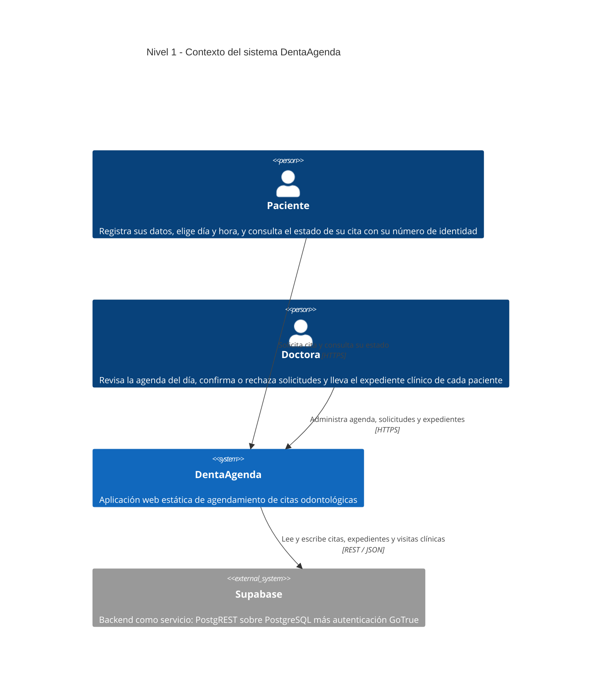
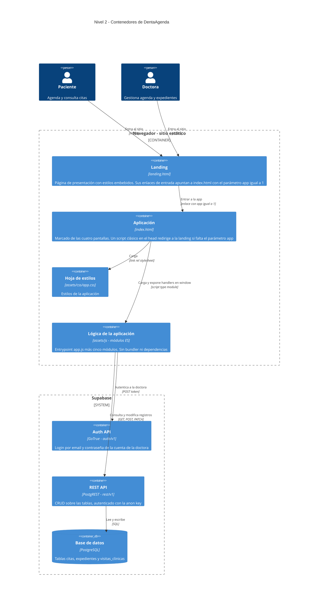
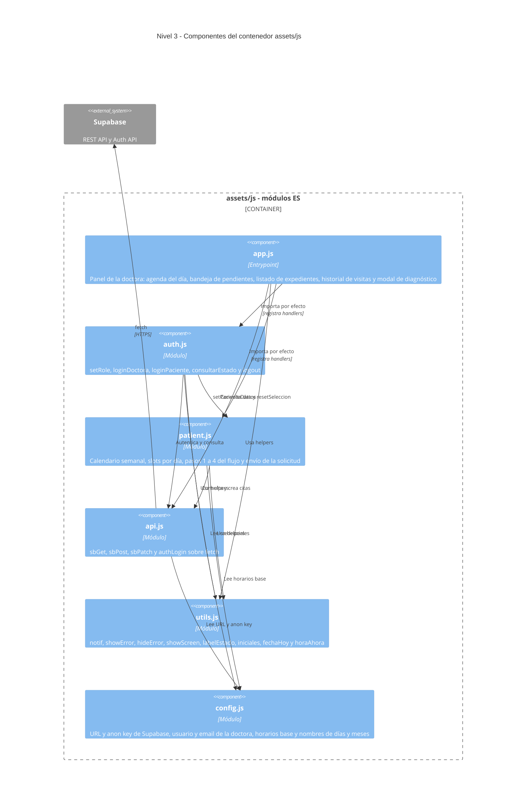
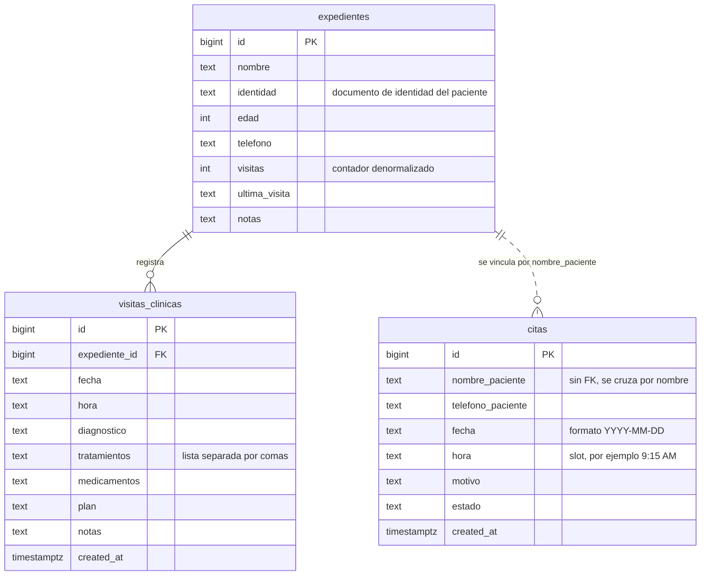
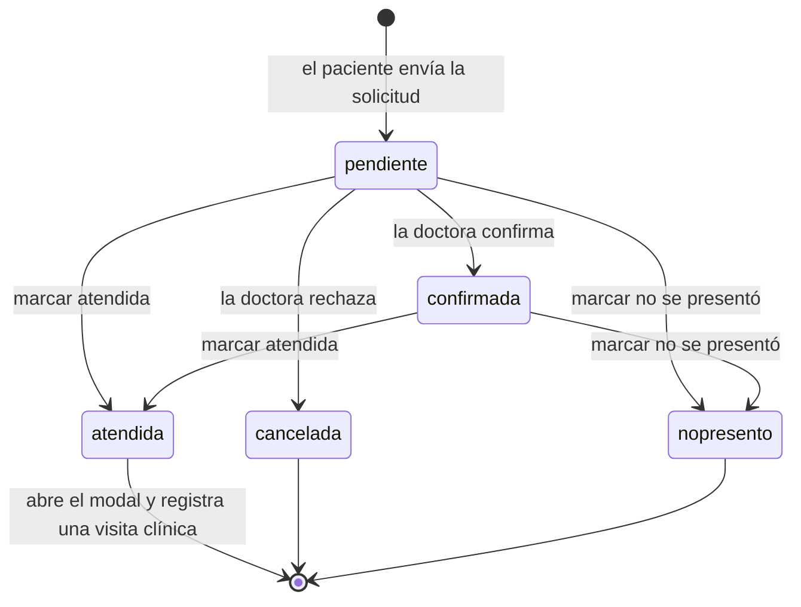

# Arquitectura — DentaAgenda

Sistema de citas odontológicas para la clínica de la Dra. Belkis Suisse.
Proyecto ISW II.

---

## Nivel 1 — Contexto

Quién usa el sistema y con qué se apoya.



---

## Nivel 2 — Contenedores

Las piezas desplegables. No hay servidor de aplicación: todo se sirve como
archivos estáticos y el navegador es el único entorno de ejecución propio.



### Pantallas dentro de `index.html`

No hay router: las cuatro pantallas conviven en el DOM y `showScreen()` alterna
la clase `.active`.

| Pantalla | `id` | Para quién |
| --- | --- | --- |
| Login / registro / consulta de estado | `screen-login` | Ambos |
| Estado de la cita | `screen-estado` | Paciente |
| Panel de la doctora | `screen-doctora` | Doctora |
| Expediente de un paciente | `screen-expediente` | Doctora |

---

## Nivel 3 — Componentes

Dentro del contenedor `assets/js`. Las flechas son dependencias reales de
`import`; el grafo es acíclico y `config.js` y `utils.js` son las hojas.



### Tamaño de cada componente

| Archivo | Líneas | Responsabilidad |
| --- | ---: | --- |
| `assets/js/app.js` | 337 | Entrypoint y todo el panel de la doctora |
| `assets/js/modules/patient.js` | 267 | Flujo de agendamiento del paciente |
| `assets/js/modules/auth.js` | 164 | Login, roles y consulta de estado |
| `assets/js/modules/utils.js` | 47 | Helpers de UI y formato |
| `assets/js/modules/api.js` | 44 | Cliente HTTP de Supabase |
| `assets/js/modules/config.js` | 9 | Constantes |

### El puente hacia `window`

El HTML invoca las funciones desde atributos `onclick`, pero un
`<script type="module">` tiene scope propio y no crea globales. Por eso cada
módulo publica en `window` **solo** las funciones que el marcado nombra:

- `auth.js` → `setRole`, `loginDoctora`, `loginPaciente`, `consultarEstado`, `logout`
- `patient.js` → `selDia`, `selSlot`, `cambiarSemana`, `irPaso1`, `irPaso2`, `irPaso3`, `enviarSolicitud`, `nuevaCita`
- `app.js` → los handlers del panel de la doctora, más `showScreen` reexportado desde `utils.js`

Estado compartido que también vive en `window`, con un solo módulo que lo
define: `cargarCitas`, `cargarPendientes`, `cargarExpedientes` y
`expedienteActual`.

---

## Modelo de datos



La relación entre `citas` y `expedientes` está punteada a propósito: **no hay
llave foránea**. El código cruza las dos tablas comparando `nombre_paciente`
contra `nombre` como texto exacto, así que dos pacientes homónimos comparten
expediente y un nombre escrito distinto no encuentra ninguno.

### Ciclo de vida de una cita



Los slots ocupados se calculan excluyendo únicamente el estado `cancelada`, así
que una cita `nopresento` sigue bloqueando su horario.

---

## Decisiones de arquitectura

| Decisión | Motivo | Costo que acepta |
| --- | --- | --- |
| Sitio estático, sin backend propio | Nada que desplegar ni mantener; publicable en GitHub Pages | Toda la lógica y las credenciales quedan del lado del cliente |
| Módulos ES nativos, sin bundler | Cero dependencias y cero paso de build | Ya no se puede abrir con doble clic: los módulos exigen `http://`, no `file://` |
| Handlers en `onclick` dentro del HTML | Es el marcado original, migrarlo era un cambio aparte | Obliga al puente hacia `window` descrito arriba |
| Landing y app en archivos separados | La landing carga sin esperar la lógica de la app | Hace falta el parámetro `app=1` y el redirect en el `<head>` |
| Supabase como backend | Base de datos y API REST sin escribir servidor | El acceso a datos depende por completo de cómo estén las políticas RLS |

---

## Deuda técnica conocida

Puntos abiertos, en orden de importancia:

1. **El control de acceso es decorativo.** `loginDoctora()` valida el usuario
   contra una constante en el cliente y luego autentica de verdad contra
   GoTrue — pero el token que devuelve no se usa: *todas* las lecturas y
   escrituras posteriores van con la anon key. Si las políticas RLS de las
   tablas no están restringidas, cualquiera con la URL del proyecto puede leer
   y modificar los expedientes clínicos completos. Es lo primero que conviene
   revisar antes de usar esto con datos reales de pacientes.
2. **`citas` y `expedientes` se cruzan por nombre**, sin llave foránea.
3. **Fechas y horas se guardan como texto.** `hora` es un literal de slot
   (`'9:15 AM'`), lo que fuerza el parseo manual que hace `cargarSlotsDia()`
   para decidir si un horario ya pasó.
4. **`app.js` mezcla dos responsabilidades**: es el entrypoint y a la vez todo
   el panel de la doctora. Partirlo en `doctora.js` y `expedientes.js` dejaría
   los seis módulos parejos.
5. **`visitas` en `expedientes` es un contador denormalizado** que se
   incrementa a mano al guardar un diagnóstico; puede desincronizarse de la
   cuenta real de filas en `visitas_clinicas`.

---

## Estructura de archivos

```
Proyecto_ISW2/
├── landing.html              página de presentación
├── index.html                marcado de la app y redirect a la landing
├── package.json              solo { "type": "module" }
├── arquitectura.md           este documento
└── assets/
    ├── css/
    │   └── app.css           estilos de la app
    └── js/
        ├── app.js            entrypoint y panel de la doctora
        └── modules/
            ├── config.js     constantes y credenciales
            ├── api.js        cliente HTTP de Supabase
            ├── utils.js      helpers de UI y formato
            ├── auth.js       login, roles y consulta de estado
            └── patient.js    flujo de agendamiento
```

> Los módulos ES no cargan por `file://`. Para abrir la app hay que servirla
> por HTTP desde la raíz del proyecto y entrar por `landing.html`, o
> directamente a `index.html?app=1`.
