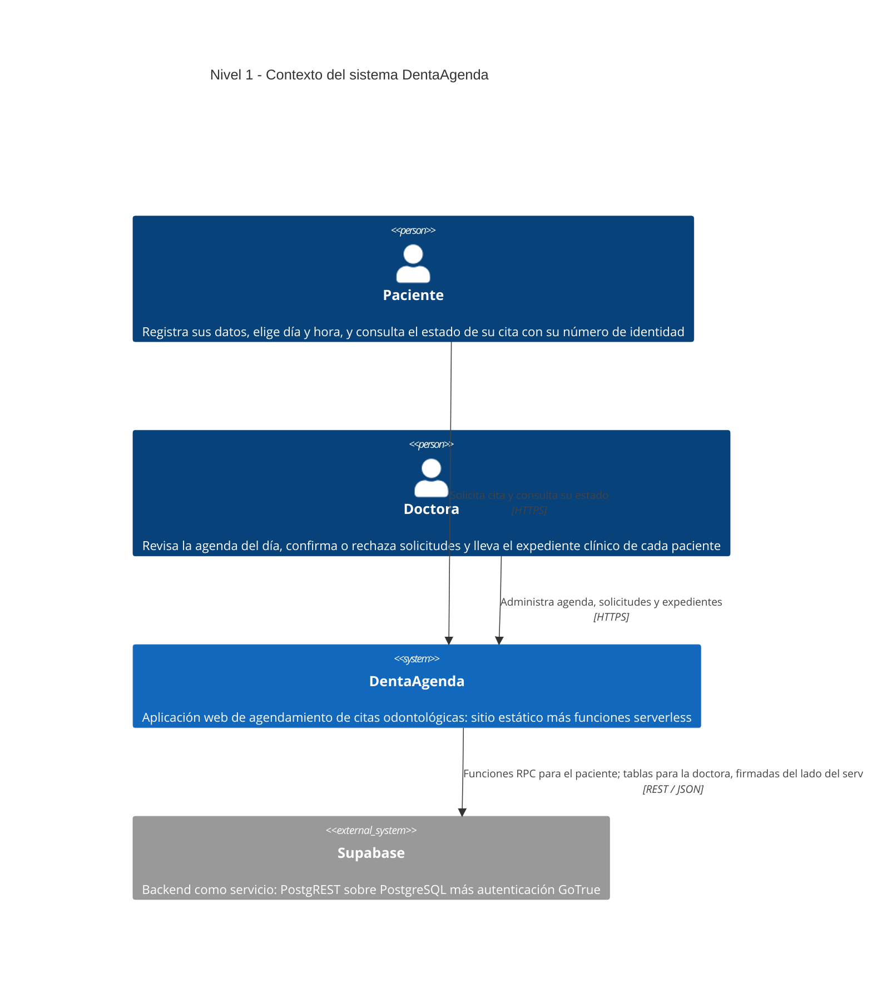
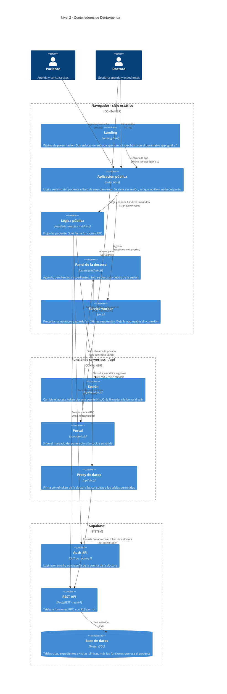
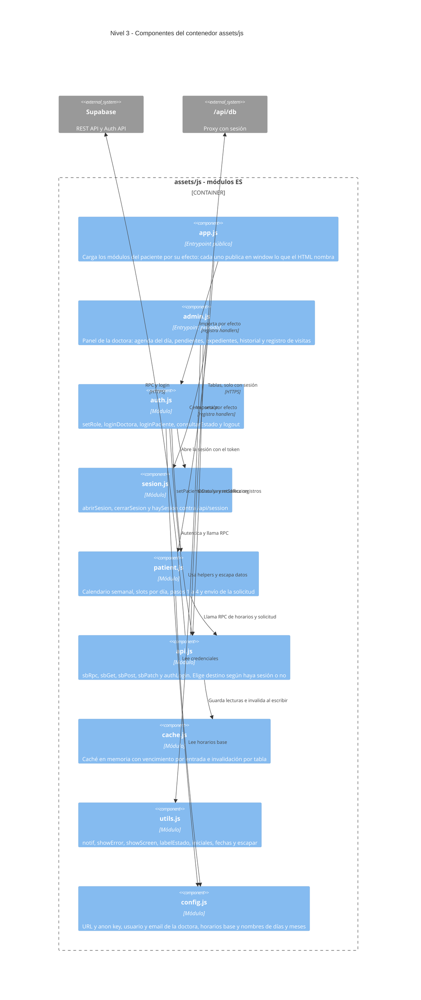
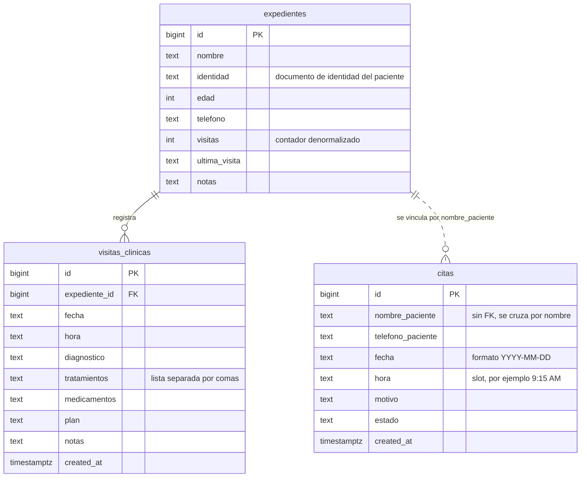
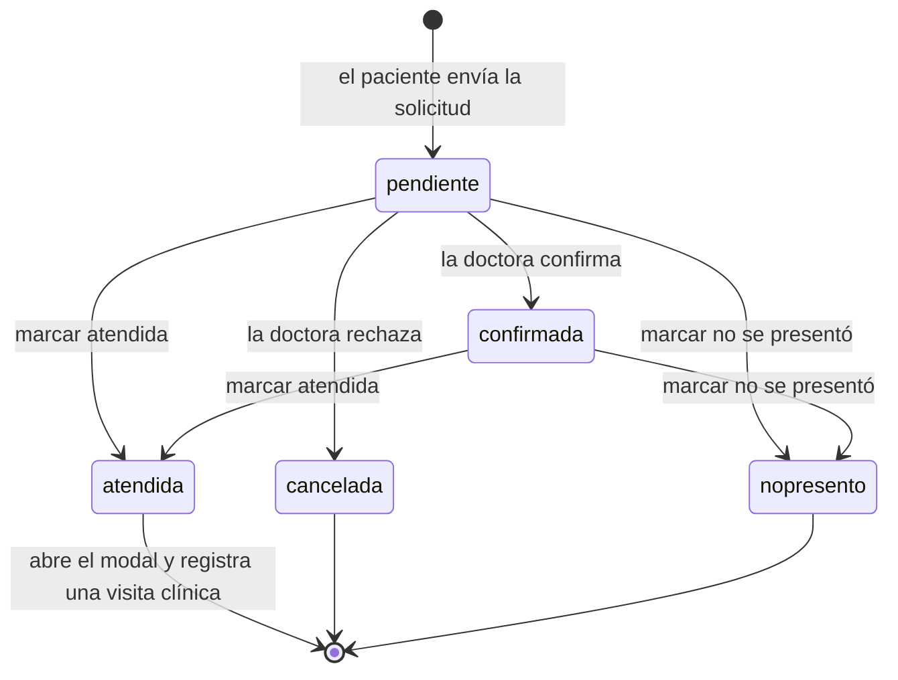
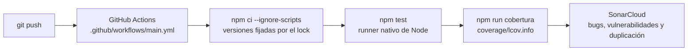

# Arquitectura — DentaAgenda

Sistema de citas odontológicas para la clínica de la Dra. Belkis Suisse.
Proyecto ISW II.

Las decisiones estructurales están registradas aparte, en
[`docs/adr/`](adr/): [ADR-001 — evolución](adr/ADR-001-evolucion.md) y
[ADR-002 — autenticación](adr/ADR-002-auth.md).

---

## Nivel 1 — Contexto

Quién usa el sistema y con qué se apoya.



---

## Nivel 2 — Contenedores

Las piezas desplegables. El sitio sigue siendo estático, pero ya no es lo
único: hay un puñado de funciones serverless que existen para que el token
de la doctora nunca baje al navegador.



Las dos mitades no comparten nada más que el dominio: el paciente entra por
funciones RPC que exponen exactamente lo que esa pantalla necesita, y la
doctora entra por un proxy que firma del lado del servidor. Ninguna de las
dos manda credenciales de administración al navegador.

### Pantallas dentro de `index.html`

No hay router: las cuatro pantallas conviven en el DOM y `showScreen()` alterna
la clase `.active`.

| Pantalla | `id` | Para quién |
| --- | --- | --- |
| Login / registro / consulta de estado | `screen-login` | Ambos |
| Estado de la cita | `screen-estado` | Paciente |
| Panel de la doctora | `screen-doctora` | Doctora |
| Expediente de un paciente | `screen-expediente` | Doctora |

---

## Nivel 3 — Componentes

Dentro del contenedor `assets/js`. Las flechas son dependencias reales de
`import`; el grafo es acíclico y `config.js` y `utils.js` son las hojas.



`api.js` tiene un solo interruptor: si existe `window.__sesion` habla con
`/api/db`, y si no, con Supabase y únicamente por RPC. Ese interruptor es lo
que mantiene separadas las dos mitades sin duplicar el cliente HTTP.

### Tamaño de cada componente

| Archivo | Líneas | Responsabilidad |
| --- | ---: | --- |
| `assets/js/admin.js` | 417 | Panel de la doctora, detrás de la sesión |
| `assets/js/modules/patient.js` | 293 | Flujo de agendamiento del paciente |
| `assets/js/modules/auth.js` | 191 | Login, roles y consulta de estado |
| `assets/js/modules/api.js` | 126 | Cliente HTTP: RPC, tablas y caché |
| `assets/js/modules/cache.js` | 73 | Caché en memoria con vencimiento |
| `assets/js/modules/utils.js` | 57 | Helpers de UI, formato y escapado |
| `assets/js/modules/sesion.js` | 36 | Ciclo de vida de la cookie de sesión |
| `assets/js/app.js` | 20 | Entrypoint público |
| `assets/js/modules/config.js` | 9 | Constantes |

Del lado serverless: `api/db.js` (67), `api/health.js` (73), `api/admin.js`
(61), `api/session.js` (54) y `api/_sesion.js` (47), que valida la cookie.

### El puente hacia `window`

El HTML invoca las funciones desde atributos `onclick`, pero un
`<script type="module">` tiene scope propio y no crea globales. Por eso cada
módulo publica en `window` **solo** las funciones que el marcado nombra:

- `auth.js` → `setRole`, `loginDoctora`, `loginPaciente`, `consultarEstado`, `logout`
- `patient.js` → `selDia`, `selSlot`, `cambiarSemana`, `irPaso1`, `irPaso2`, `irPaso3`, `enviarSolicitud`, `nuevaCita`
- `app.js` → los handlers del panel de la doctora, más `showScreen` reexportado desde `utils.js`

Estado compartido que también vive en `window`, con un solo módulo que lo
define: `cargarCitas`, `cargarPendientes`, `cargarExpedientes` y
`expedienteActual`.

---

## Modelo de datos



La relación entre `citas` y `expedientes` está punteada a propósito: **no hay
llave foránea**. El código cruza las dos tablas comparando `nombre_paciente`
contra `nombre` como texto exacto, así que dos pacientes homónimos comparten
expediente y un nombre escrito distinto no encuentra ninguno.

### Ciclo de vida de una cita



Los slots ocupados se calculan excluyendo únicamente el estado `cancelada`, así
que una cita `nopresento` sigue bloqueando su horario.

---

## Decisiones de arquitectura

Las dos estructurales están registradas como ADR, con su contexto y sus
consecuencias completas:

- [**ADR-001**](adr/ADR-001-evolucion.md) — Evolución de DentaAgenda para
  mejorar su facilidad de uso.
- [**ADR-002**](adr/ADR-002-auth.md) — Guardar la sesión de la doctora en una
  cookie HttpOnly emitida por el servidor, en vez del token en el navegador.

El resto son decisiones menores, que no ameritan un documento propio:

| Decisión | Motivo | Costo que acepta |
| --- | --- | --- |
| Módulos ES nativos, sin bundler | Cero dependencias y cero paso de build | No se puede abrir con doble clic: los módulos exigen `http://`, no `file://` |
| Handlers en `onclick` dentro del HTML | Es el marcado original, migrarlo era un cambio aparte | Obliga al puente hacia `window` descrito arriba |
| Landing y app en archivos separados | La landing carga sin esperar la lógica de la app | Hace falta el parámetro `app=1` y el redirect en el `<head>` |
| Panel en `admin.js`, fuera de `index.html` | `index.html` se sirve sin sesión; el marcado privado no debe viajar a quien no entró | Una petición más al abrir el portal |
| Tests con el runner nativo de Node | Cero dependencias, como el resto del proyecto | Hay que pasar globs en los scripts, y expandirlos pide Node 21 o más |

---

## Deuda técnica conocida

Puntos abiertos, en orden de importancia:

1. **`citas` y `expedientes` todavía no tienen llave foránea.** Las citas nuevas
   ya guardan `identidad`, así que cruzan bien; las viejas siguen cruzándose por
   nombre. Falta rellenar lo histórico y recién ahí poner la FK.
2. **Fechas y horas se guardan como texto.** `hora` es un literal de slot
   (`'9:15 AM'`), lo que fuerza el parseo manual que hace `cargarSlotsDia()`
   para decidir si un horario ya pasó. Es el origen del caso raro de las 12:15
   PM, que hay que probar aparte.
3. **`admin.js` hace de todo**: agenda, pendientes, expedientes, historial y
   modal de diagnóstico en un solo archivo de 417 líneas. Partirlo en
   `agenda.js` y `expedientes.js` dejaría los módulos parejos.
4. **El expediente se busca por nombre exacto.** `marcarAtendida` cruza
   `nombre_paciente` contra `nombre`; un nombre escrito distinto no encuentra
   expediente. El cruce por `identidad`, que las citas ya guardan, es lo que
   resolvería esto junto con el punto 1.
5. **`visitas` en `expedientes` sigue siendo un contador denormalizado.** Ya no
   se desincroniza —el cliente escribe un recuento absoluto— pero el dato sigue
   duplicado respecto de `visitas_clinicas`. El trigger de
   `migracion/007_sincronizar_visitas.sql` lo hace responsabilidad de la base.

---

## Caché

Tres niveles, cada uno resolviendo un problema distinto.

**Datos, en memoria** — [`assets/js/modules/cache.js`](assets/js/modules/cache.js).
`sbGet` guarda cada respuesta bajo la clave `tabla?query` con vencimiento de 30 s
por defecto, y toda escritura invalida las claves de la tabla afectada. Ataca la
redundancia medible: `cargarExpedientes()` trae la tabla entera y se dispara en
cada cambio a la pestaña Expedientes. Vive mientras viva la pestaña; al recargar
arranca vacía, a propósito — guardar expedientes clínicos en disco es una
decisión aparte, no un efecto secundario de querer menos peticiones.

Una dependencia cruzada que no es obvia: escribir en `visitas_clinicas` invalida
también `expedientes`, porque el trigger de `007` mueve el contador del lado de
la base.

**Lo que nunca se cachea.** Cinco lecturas van con `{ cache: false }`, y no es
una optimización sino una condición de correctitud: de ellas depende si se
escribe o no. Servir una respuesta vieja ahí dejaría pasar un duplicado y
desharía el trabajo de idempotencia. `cache: false` manda `no-store` en el
`fetch`, así que también saltea la caché del service worker.

| Lectura | Por qué debe ser fresca |
| --- | --- |
| `cargarSlotsDia` | Mostrar libre un horario ya tomado es el peor error de esa pantalla |
| `enviarSolicitud` · quién ocupa el slot | Decide si se crea la cita |
| `guardarDiagnostico` · visita duplicada | Decide si se inserta |
| `guardarDiagnostico` · conteo de visitas | Ese número se escribe |
| `abrirExpediente` · relectura | Su sentido es traer el expediente al día |

**Offline, con service worker** — [`sw.js`](sw.js). Precarga los estáticos y
sirve los datos con **red primero y caché de respaldo**. No es
stale-while-revalidate a propósito: esta app lee las mismas tablas que escribe,
así que servir datos viejos a alguien con conexión mostraría horarios libres que
ya no lo están. Con red se ve lo último; sin red, lo último que se vio. Nunca
toca `POST`, `PATCH` ni el login.

**Estáticos, por versionado** — `node scripts/versionar.mjs` sella el CSS y el JS
de entrada con el hash de su contenido y renombra las cachés del service worker.
Correrlo antes de publicar es lo que impide que un navegador siga sirviendo la
versión anterior. El script es idempotente: si nada cambió, no toca ningún
archivo.

Para inspeccionarla desde la consola del navegador: `cacheEstado()` devuelve
entradas, aciertos, fallos y tasa de aciertos; `cacheLimpiar()` la vacía.

---

## Idempotencia

Los tres caminos de escritura dejan el mismo estado se ejecuten una o diez
veces. Cada uno lo consigue distinto:

| Operación | Cómo se vuelve repetible |
| --- | --- |
| `loginPaciente` | `upsert` sobre `identidad` en una sola ida. Manda solo los datos que el paciente escribe: incluir `visitas` o `ultima_visita` le borraría el historial a quien vuelve |
| `enviarSolicitud` | Consulta quién ocupa el horario y decide por **identidad**, no por nombre: si la cita ya es suya muestra la confirmación, si es de otro avisa sin intentar crearla. El nombre solo se usa de respaldo para las citas viejas, creadas antes de que se guardara `identidad` |
| `guardarDiagnostico` | Descarta por clave natural —expediente, día y diagnóstico— y después escribe un recuento **absoluto** de visitas, no un incremento sobre la copia local |

`marcarAtendida`, `cambiarEstado` y `accionPendiente` ya lo eran: hacen `PATCH`
a un valor fijo.

Del lado de la base, los scripts de `migracion/` además **convergen**: correrlos
sobre una base que ya existe le agrega las columnas y restricciones que le
falten, en vez de no hacer nada. `migracion/010_comprobaciones.sql` verifica que
no haya quedado nada duplicado.

---

## Calidad



**Tests** — 124 casos en [`test/`](../test/), sin dependencias. Cada archivo es
autocontenido: monta un DOM mínimo y una base falsa que aplica las mismas
reglas que el SQL, incluido el índice único de `006`. El caso central es
`doble-reserva`: dos personas no pueden quedarse con el mismo horario, y se
prueba de las dos puntas.

**Cobertura** — `npm run cobertura` deja `coverage/lcov.info` y
`coverage/coverage-summary.json`, ambos versionados. Hoy: **92.23% de líneas**
(1127/1222), 80.77% de funciones, 78.13% de ramas. El script sale con error si
las líneas bajan del 60%.

**Integración continua** — el workflow instala con `npm ci --ignore-scripts`
—versiones exactas del lock y sin ejecutar hooks de terceros— y corre la suite
en Node 24.

---

## Estructura de archivos

```
Proyecto_ISW2/
├── landing.html              página de presentación
├── index.html                app pública: login y flujo del paciente
├── sw.js                     service worker: offline y caché de datos
├── manifest.json             metadatos de la PWA
├── vercel.json               rutas: /login, /admin y las funciones
├── docs/
│   ├── arquitectura.md       este documento
│   └── adr/                  decisiones registradas
│       ├── ADR-001-evolucion.md
│       └── ADR-002-auth.md
├── api/                      funciones serverless
│   ├── session.js            emite y borra la cookie de sesión
│   ├── admin.js              sirve el portal solo con sesión válida
│   ├── db.js                 proxy firmado hacia las tablas
│   ├── health.js             chequeo de estado
│   └── _sesion.js            validación de la cookie
├── scripts/
│   ├── cobertura.mjs         genera coverage/ y exige el mínimo
│   ├── versionar.mjs         sella los estáticos con el hash del contenido
│   ├── verificar-sitio.mjs   audita el sitio en vivo
│   └── verificar-rls.mjs     comprueba que anon no llegue a las tablas
├── coverage/                 reportes de cobertura, versionados
├── test/                     unidad e integración, runner nativo
├── migracion/                scripts SQL de la base
└── assets/
    ├── css/app.css           estilos de la app
    └── js/
        ├── app.js            entrypoint público
        ├── admin.js          panel de la doctora
        └── modules/
            ├── config.js     constantes y credenciales públicas
            ├── cache.js      caché en memoria con vencimiento
            ├── api.js        cliente HTTP: RPC o proxy según la sesión
            ├── utils.js      helpers de UI, formato y escapado
            ├── sesion.js     ciclo de vida de la cookie
            ├── auth.js       login, roles y consulta de estado
            └── patient.js    flujo de agendamiento
```

> Los módulos ES no cargan por `file://`. Para abrir la app hay que servirla
> por HTTP desde la raíz del proyecto y entrar por `landing.html`, o
> directamente a `index.html?app=1`.
